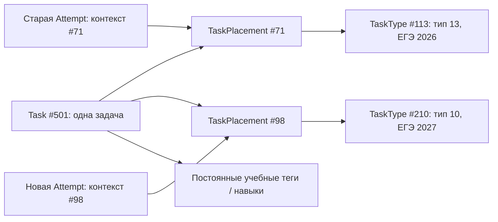

**Ежегодная смена версии экзамена: исследование и предлагаемая архитектура**

Дата: 8 сентября 2026 года. Статус: предложение по результатам изучения исходного кода и открытых первичных источников; изменения приложения и базы данных не выполнялись.

**Рекомендация**

Оставить один общий банк заданий, создавать отдельные версии экзамена и отдельные экзаменационные типы на каждый год, а применимость задания к типу хранить в новой таблице `TaskPlacement`. Каждая попытка должна навсегда сохранять контекст, в котором ученик решал задание. Историю результатов считать по этому контексту; текущую готовность к новому экзамену — по совместимым свидетельствам знаний и требованиям нового года.

Ежегодное действие: создать новую структуру экзамена и новые связи с существующими заданиями. Старые типы, задания, попытки и результаты при этом не переименовываются и не перемещаются.

Пример «13 → 10» ниже условный: это сценарий пользователя, а не утверждение об изменениях ФИПИ. На дату исследования ФИПИ публикует материалы 2027 года как проекты. Поэтому для будущего экзамена нужны черновик и явная публикация после методической проверки. Источник: [ФИПИ — демоверсии, спецификации и кодификаторы](https://fipi.ru/ege/demoversii-specifikacii-kodifikatory).

**1. Какие подходы обнаружены у похожих проектов**

| Проект | Что подтверждено публичным источником | Вывод для нашей системы |
| --- | --- | --- |
| PrairieLearn | Банк вопросов принадлежит курсу; учебные периоды представлены отдельными экземплярами курса; один вопрос используется в нескольких экзаменах и периодах. [Описание модели](https://docs.prairielearn.com/concepts/index.html). Новый период можно создать копированием структуры прежнего. [Course instances](https://docs.prairielearn.com/courseInstance/). | Наиболее подходящий образец: общий контент и отдельные ежегодные структуры. |
| Moodle | Общие банки позволяют использовать вопросы в разных курсах. В конкретном тесте можно закрепить определённую версию вопроса; тогда последующие правки банка не заменяют её. [Question banks](https://docs.moodle.org/502/en/Question_bank). | Разделять идентичность задания, его редакцию и использование в экзамене. |
| Stepik | Копирование курса переносит содержание и настройки, но не решения и статистику учащихся; копия получает новую ссылку. [Справка о копировании](https://help.stepik.org/article/54790). | Полный клон удобен для независимого потока, но сам по себе не решает задачу непрерывного прогресса одного ученика. |
| «Решу ЕГЭ» / «Сдам ГИА» | Каталог информатики имеет представления по типам и по темам. [Каталог](https://inf-ege.sdamgia.ru/sgia_catalog). | В интерфейсе полезны две классификации: позиция в экзамене и содержание задания. |

Это подтверждённые свойства интерфейсов и документации. Из них нельзя заключить, как устроены закрытые базы данных или внутренний перенос статистики Stepik и «Решу ЕГЭ». Предлагаемая ниже схема — наша инженерная рекомендация с учётом текущего проекта.

**2. Что уже есть в проекте и где возникает риск**

Проверен текущий рабочий каталог, включая незакоммиченные изменения. Производственная база не исследовалась, поэтому количество проблемных записей и полнота исторических данных пока неизвестны.

| Участок | Текущее устройство | Следствие |
| --- | --- | --- |
| `ExamVersion`, `TaskType` в [models.py](../../apps/recsys/models.py) | Версии экзамена существуют; тип уже может принадлежать конкретной версии. | Эту основу сохраняем. Не нужно превращать годовой `TaskType` в универсальную тему. |
| `Task` | Имеет единственные `exam_version` и `type`. | Одно задание нельзя штатно включить в два года под разными типами без копии или изменения старой связи. |
| `Attempt` | Сохраняет задание, баллы, время и часть контекста попытки, но не собственные год и тип. | Историческая классификация зависит от текущего `Task`. |
| [services.py](../../apps/recsys/services.py), `_update_type_mastery` | Считает попытки через `task__type`; показатель освоения агрегирует из текущих тегов заданий. | Изменение связи задания меняет группировку истории; новые результаты по общему тегу могут менять оценку старого типа. |
| [type_progress.py](../../apps/recsys/service_utils/type_progress.py) | Использует текущие `required_tags`, опубликованный банк, `task__type` и `task__tags`. | Меняются не только номера: добавление заданий или изменение тегов влияет на отображаемый прогресс. |
| [recommendation.py](../../apps/recsys/recommendation.py), `_select_candidates` | Фильтрует непосредственно `Task.exam_version` и `Task.type`; недавние решения исключает по `Task.id`. | Фильтры нужно перевести на связи; стабильный ID задания полезно сохранить для учёта повторений между годами. |
| `TrainingSessionStep`, `VariantTaskAttempt` | Уже имеют снимки задания; тренировочный снимок содержит название типа. | Есть основа для фиксации истории, но собственного устойчивого контекста каждой `Attempt` пока нет. |
| [training.py](../../apps/recsys/service_utils/training.py), `_freshen_open_task_snapshot` | Может обновлять HTML, изображения и вложения открытого задания из текущей карточки. | Начатая работа не полностью изолирована от редактирования банка. |
| [variants.py](../../apps/recsys/service_utils/variants.py) | `build_tasks_progress` берёт название типа из текущего задания; `calculate_attempt_primary_summary` берёт максимум из текущих задач шаблона. | Старый вариант может показываться с новым названием типа или новым максимально возможным баллом. |
| `Skill`, `TaskTag`, `SkillMastery`, `TagMastery` | Навыки и теги относятся к предмету, без года. | Уже есть основа для переноса знаний между экзаменами. При этом теги должны иметь устойчивый учебный смысл. |
| `ExamVersion.status` | Есть `draft` и `active`, отдельного архива нет. | Добавить архив и отдельно определить доступ к ранее выполненным работам. |
| Связи моделей | Многие зависимости используют `CASCADE`, включая `Attempt.task` и `Task.type`. | Удаление используемого задания или типа способно уничтожить историю. Для исторических зависимостей нужны защита удаления и архивирование. |

Старые `TypeMastery` нельзя считать неизменяемым архивом. Команда `recompute_recsys_state` обновляет их из общих тегов; команда `recompute_mastery` применяет другой расчёт по попыткам. Сохранение прежних строк без разделения назначения показателей недостаточно.

**3. Предлагаемая модель связей**



`Task` — постоянная карточка задания: ID, предмет, содержание, источник, файлы, генератор и учебные признаки. Существующие ID сохраняются. Номер в экзамене не является идентификатором содержания. Год источника, например «демоверсия 2026», также не определяет, в каких будущих экзаменах разрешено использовать задачу.

`TaskType` — требования и обозначение типа внутри конкретной версии экзамена. Существующие записи 2026 года остаются. Для 2027 создаются новые записи с новыми ID, даже если название и номер не изменились. `display_order` отвечает за сортировку; при необходимости отдельное поле `number` отвечает за официальный номер. Нельзя автоматически считать их одним и тем же.

`TaskPlacement` — новая явная связь:

```text
TaskPlacement
  id
  task_id               -> Task, PROTECT
  task_type_id          -> TaskType, PROTECT
  status                draft / active / retired
  scoring_scheme        необязательное переопределение для данного использования
  max_score             необязательное переопределение
  answer_schema_id      необязательное переопределение
  created_at, updated_at

  UNIQUE(task_id, task_type_id)
```

Год определяется через `task_type.exam_version`; отдельный изменяемый `exam_version` в этой таблице не требуется. Для экзаменационных связей версия типа обязательна. Предмет задачи должен совпадать с предметом типа и экзамена. Использованную связь нельзя переназначать другому заданию или типу; её можно исключить из будущей выдачи, сохранив для истории.

Схема допускает несколько назначений одной задачи, в том числе в разные типы одного года, если это методически оправдано. При решении всегда выбирается ровно одно назначение. Выборка банка и сборка варианта устраняют повторы по `Task.id`, если повторение задачи не разрешено явно. Одну попытку нельзя записывать как две из-за двух связей.

`VariantTask` и `TrainingSessionStep` получают выбранный `placement_id`. `VariantTask.order` остаётся позицией в конкретной работе: учитель может поставить тип 13 первым в домашнем задании. Эти два номера не смешиваются.

`ExamVersion` стоит дополнить структурированными `exam_kind` (ЕГЭ/ОГЭ и т. п.), `year`, статусом `archived` и способом выбрать версию по умолчанию для пары предмет–вид экзамена. Название остаётся для отображения. Уникальность пары предмет–вид–год достаточна для первого этапа; если понадобится несколько опубликованных структур одного года, в ключ добавляется редакция. Год нельзя вычислять из строки названия или даты решения.

Опубликованные и уже использованные требования, нумерация и правила оценивания фиксируются. Содержательная правка создаёт новую редакцию конфигурации; архив и начатые работы продолжают ссылаться на прежнюю. Доступность для будущих запусков меняется отдельно от содержательной конфигурации.

**4. Что фиксировать при выдаче и решении задания**

Контекст фиксируется при выдаче задания, а не определяется повторно при отправке ответа. В каждой `Attempt` должны храниться `placement_id`, собственные `exam_version_id`, `task_type_id` и ссылка на неизменяемый снимок выданного задания либо сам снимок. Дублирование ID здесь намеренное: это факт события. Все значения назначает сервер и проверяет на согласованность.

Снимок содержит:

- ID и отображаемые названия экзамена и типа; официальный номер типа и позицию в работе.
- Фактически выданное условие и набор данных; для генератора — версию генератора, seed, параметры и результат генерации.
- Правильный ответ, схему ввода, правила оценивания и максимум баллов. Эти служебные данные не выдаются клиенту преждевременно.
- Учебные теги/навыки и их веса, использованные для аналитики; значимые параметры сложности и ожидаемого времени.
- Версию формата снимка; для файлов — устойчивые ссылки на неизменяемые объекты, при необходимости контрольные суммы.

`score`, `max_score`, результат проверки, время и валидность уже частично есть в моделях и сохраняются. Исправление ошибочной проверки оформляется отдельным зарегистрированным пересчётом с причиной и прежним результатом, а не незаметным переписыванием истории.

Для `VariantAttempt` дополнительно фиксируются состав и порядок работы, лимит времени, суммарный максимум и применённая шкала перевода баллов. Нельзя заново брать эти значения из редактируемого `VariantTemplate`, текущих `TaskType` или текущей шкалы при просмотре завершённой работы. Если официальная шкала ещё неизвестна, вторичный балл отсутствует или явно помечается предварительным.

Сами копии JSON не сохранят файлы, если по прежнему URL перезаписать изображение или очистить вложения. Политика файлов должна сохранять объекты, на которые ссылаются исторические снимки.

Правила приоритета оценивания надо сделать явными. Для первого этапа: переопределение `TaskPlacement` → существующее переопределение `Task` → значения выбранного годового `TaskType`. Если `ExamBlueprintItem.score_override` используется для конкретной работы, его результат также входит в зафиксированный контекст работы. Все значения разрешаются один раз при выдаче; история читает готовый результат.

**5. Как сохранить статистику и перенести знания**

Нужны три разных представления данных.

| Представление | Что означает | Источник |
| --- | --- | --- |
| История экзамена 2026 | Какие задания и типы ученик решал именно в формате 2026; ответы, баллы, время, число попыток | `Attempt` с зафиксированными `exam_version_id` и `task_type_id` |
| Текущая готовность к экзамену 2027 | Насколько накопленные знания соответствуют требованиям формата 2027 | Совместимые учебные свидетельства, устойчивые теги/навыки, требования нового `TaskType` |
| Состояние на дату | Какой прогресс, покрытие и оценку готовности система показывала на выбранный момент | Отдельный неизменяемый `ExamProgressSnapshot` |

`TypeMastery` можно оставить как кэш текущей готовности для совместимости API. Его нельзя использовать как архивное значение «на конец 2026 года». Счётчики реальных попыток считаются отдельно по контексту события; при необходимости их можно материализовать позже. Перенесённые свидетельства отображаются отдельным количеством, не прибавляются к попыткам нового года.

`ExamProgressSnapshot` хранит пользователя, версию экзамена, `as_of`, версию алгоритма, версию требований и данные по типам: значения показателей, числители/знаменатели покрытия и размер использованного банка. При закрытии периода создаётся снимок. Если нужен график изменений, снимки создаются также периодически или после значимых событий. Это сохраняет старый процент даже после расширения банка и изменений алгоритма.

Статистика года означает **формат экзамена**, а календарный период задаётся дополнительным фильтром. Решение варианта 2026 года в январе 2027 остаётся попыткой формата 2026. Оно не меняет ранее сделанный снимок «на 31 августа», но может появиться в полном списке попыток формата 2026.

Пример, значения условные:

| Экран | До новой попытки | После одной новой верной попытки |
| --- | --- | --- |
| Архив 2026, тип 13 | 20 попыток, 15 верных | 20 попыток, 15 верных |
| Подготовка 2027, тип 10 | 0 попыток в формате 2027; учтён опыт прежних лет | 1 попытка в формате 2027, 1 верная; прежний опыт продолжает учитываться |
| Все реальные решения ученика | 20 | 21 |

Показатель готовности нового года не обязан равняться `15/20`: он зависит от состава тем, сложности, повторений, давности и выбранного алгоритма. Для простого переименования при одинаковых требованиях и одинаковом моменте расчёта он должен быть согласован с прежней оценкой знаний; это отдельный критерий проверки.

У проекта уже есть `TaskTag` и `TagMastery`, поэтому новый обязательный справочник `CanonicalTaskType`/`TaskFamily` сейчас не нужен. Сначала следует выделить среди тегов учебные признаки с устойчивым смыслом и отдельными кодами, например `ip.subnet.host-count`. Метки источника, года, автора и технического формата в оценку знаний не входят. `Skill` также уже существует, но текущий алгоритм во многом опирается на теги; объединять эти справочники одновременно с переходом года необязательно.

Один старый тег нельзя переименовать так, чтобы он стал означать другой навык. При разделении крупной темы нужны новые признаки и разметка конкретных старых заданий либо новая диагностика. Если исходные данные не позволяют достоверно распределить прежние решения, частичный перенос остаётся неопределённым; процент не придумывается.

**Правило расчёта новой готовности:** требования явно задаются на новом типе через `required_tags` (при необходимости — связь с весами). Не следует выводить требования из объединения всех тегов случайно попавших в банк заданий. Для каждого требования отбираются совместимые свидетельства, учитываются давность и контекст. Отсутствующие темы отмечаются как непроверенные и не исключаются из знаменателя так, чтобы искусственно повышать готовность. Непустой перенос знаний не заменяет диагностику новых требований.

Для показателя «уже решены задачи из нового банка» допустимо пересечение новых `TaskPlacement` с прежними валидными решениями по стабильному `Task.id`, с проверкой совместимости редакции и критериев. Такой счётчик подписывается «включая прошлые годы». Для события «решал в 2027» используется только собственный контекст попытки.

Нельзя дважды обновлять `TagMastery` одной и той же попыткой при подготовке нового года или повторном запуске миграции. Проекции на разные типы могут учитывать одно свидетельство, но глобальное количество реальных решений остаётся прежним. `Attempt` и соответствующая `VariantTaskAttempt` — две записи одного логического ответа, их нельзя суммировать как независимые решения. Техническая выдача с `attempt_number=0` не является ответом.

**6. Правила перехода между типами**

| Изменение | Работа с банком | Работа со статистикой и готовностью |
| --- | --- | --- |
| Поменялся только номер: 13 → 10 | Новый годовой тип и новые связи с теми же `Task` | История остаётся у 13/2026; совместимый опыт учитывается для 10/2027. |
| Номер тот же, содержание заменено | Новый тип нового года и заново проверенный набор связей | Совпадение номера ничего не переносит автоматически. |
| Старый тип разделён на два | Конкретные задания распределяются по новым типам; при необходимости одна задача применима к обоим | Свидетельства отбираются по заданиям и навыкам. Нельзя просто скопировать прежние 80% в обе новые строки. |
| Два типа объединены | Новый тип получает объединённый проверенный набор задач и требований | Расчёт из исходных свидетельств без повторов, а не среднее двух процентов. |
| Тип частично изменён | Сохраняются только подходящие связи; добавляются новые задачи и требования | Старый опыт учитывается только в совместимой части; новая часть требует диагностики. |
| Тип исключён | В новом экзамене его нет; старый банк остаётся доступен по архивным правилам | История сохраняется; исключённый тип не входит в готовность к новому экзамену. |
| Изменились баллы или формат ответа | Меняются правила нового использования; при изменении самого задания нужна редакция | Старые первичные и вторичные баллы сохраняются. Нормализация `score/max_score` сама по себе не доказывает сопоставимость новых критериев. |
| Появился совершенно новый тип | Создаются новый тип, требования и банк | Известные навыки могут дать частичное основание; новых фактических попыток нет. |

Для ежегодной работы методиста полезен журнал `TaskTypeTransition`: старый тип, новый тип, вид соответствия (`equivalent`, `partial`, `split`, `merge`, `added`, `removed`), комментарий, основание и статус проверки. Разделение/объединение представлены несколькими связями; для добавления или удаления одна сторона отсутствует. Это план и объяснение перехода, а не источник исторической классификации попыток и не команда копирования процентов.

Чистое соответствие 1:1 можно применять массово после проверки одинаковых требований. Частичные соответствия должны содержать явный список задач/тем либо проверяемое правило отбора. При публикации результат правила фиксируется в конкретных `TaskPlacement`. Архив не должен зависеть от постоянно меняющегося запроса по тегам.

**7. Ежегодный процесс в админке**

1. Методист выбирает «Создать следующий год» у экзамена 2026. Создаются черновик 2027, новые годовые типы, копии структуры `ExamBlueprint`, требований, настроек и черновики связей. Сами `Task`, решения, файлы и ученики не копируются. Прежняя шкала баллов считается неподтверждённой до проверки.
2. Открывается таблица соответствий: старый тип, новый тип, характер изменения, число задач, число исключений, новые требования, критерии проверки. По умолчанию можно предложить прежнее соответствие, но одинаковый номер не означает автоматическое методическое одобрение.
3. Методист подтверждает неизменные типы массово и разбирает исключения. Для разделений и объединений доступны выбор задач и фильтры по учебным тегам.
4. Система показывает предварительный отчёт: новые/удалённые типы, покрытие требований, нехватку опубликованных заданий, ошибки предмета/версии, конфликты критериев, дубликаты в варианте. Проверяет, что обязательные позиции можно заполнить различными подходящими задачами с учётом пересекающихся пулов.
5. Перед публикацией проверяются демоверсия, спецификация, кодификатор и правила оценивания. Публикуется весь согласованный набор атомарно либо через подготовленную неизменяемую редакцию; до этого ученик его не получает.
6. Для новых пользователей 2027 становится рекомендуемой версией. У существующих учеников сохраняется выбор целевого экзамена; смена года не должна автоматически переписывать назначения учителя и незавершённые сессии. Текущая попытка завершается в своём исходном формате.
7. Для 2026 создаются снимки на дату закрытия, версия переводится в архив. Просмотр своих ответов и отчётов доступен независимо от запрета новых запусков. Общие задачи не переводятся глобально в `Task.status=archived` только из-за архивирования одного экзамена.

Нужна отдельная проверка права просмотра истории: сейчас `get_assignment_or_404` в `variants.py` использует готовность шаблона к публичной выдаче. Архивирование или снятие задачи с публикации не должно скрывать уже выполненную работу её владельца и уполномоченного преподавателя.

Нейтральный адрес вроде `/informatics/ege/` может открывать рекомендуемый год. Адреса с явным годом и ссылки на старые попытки продолжают открывать соответствующую версию. Источник задания и путь старого файла с `2026` в имени не нужно переименовывать при добавлении связи на 2027.

**8. Как внедрить в существующий Django-проект**

**Этап A — сначала сохранить доступную историю.** Добавить поля контекста и снимки без удаления старых полей. Зафиксировать текущие показатели и определить дату перехода. Получить отчёт по отсутствующим версиям, несовпадениям `Task.exam_version` и `Task.type.exam_version`, отсутствующим снимкам и изменённым источникам. Сделать резервную копию базы и медиаданных перед миграциями.

Исторический контекст восстанавливается в порядке доверия: существующий снимок → контекст конкретной сессии/варианта → непротиворечивая текущая связь задания как явно обозначенное предположение. Контекст варианта может установить год, но не гарантирует прежний тип, если задание уже переносили. Для каждой восстановленной записи хранить происхождение (`snapshot`, `session`, `inferred`, `unknown`) и описание неоднозначности. Неизвестные данные сохраняются в истории, но не выдаются за точную годовую статистику.

Если в прошлом не было снимков показателей или журналов изменений, точный процент, который ученик видел на произвольную прошлую дату, восстановить гарантированно нельзя. Можно сохранить доступные факты и текущее состояние, затем обеспечить точность последующих снимков. Не следует обещать восстановление уже утраченной информации.

**Этап B — добавить совместное использование банка.** Создать `TaskPlacement`, заполнить связи существующих заданий и подготовить административный интерфейс. На время перехода старые `Task.type` и `Task.exam_version` остаются только совместимыми полями для старого пути; они не становятся «основным годом» задания. Новые читатели используют назначения, новые события сразу пишут свой контекст. Создание 2027 включается после перевода критических читателей.

Изменить выборки рекомендаций, каталог, загрузку задач, редактор, сборку вариантов, тренировочные фильтры, проверки публикации и API. Там, где раньше хватало `task_id`, теперь требуется выбранное назначение или однозначный серверный контекст экзамена и типа. Если подходящих назначений несколько, молча выбирать первое нельзя.

**Этап C — развести аналитику.** Исторические запросы переводятся с `task__type` на `Attempt.task_type_id` и собственный экзамен события. Текущая готовность считается по требованиям выбранного года. Добавляется отдельная выдача `ExamProgressSnapshot`. Оба пути пересчёта (`recompute_mastery`, `recompute_recsys_state`) приводятся к согласованному назначению и версии алгоритма. Старые имена/максимумы в истории берутся из снимков.

Готовность нового типа вычисляется и до первой попытки в новом году: по запросу или отдельной инициализацией проекций. Текущая команда пересчитывает только существующие строки `TypeMastery`, поэтому одного запуска этой команды для появления нового годового прогресса недостаточно. Для каждого показателя также фиксируется определение успеха: полный правильный ответ и действующий в части аналитики порог нормализованного балла — разные величины.

Заполнение старых полей контекста не должно повторно запускать обработчик `post_save` и начислять знания за существующие попытки. Массовое восстановление и пересчёт должны быть отдельными идемпотентными операциями; для событий используется стабильный ключ, при живой записи агрегаты обновляются транзакционно. Повторный запуск не меняет количество реальных ответов.

**Этап D — первый переход года.** Добавить мастер перехода, журнал соответствий, предварительный отчёт и публикацию. На копии базы выполнить переход 2026 → 2027; сравнить сохранённые архивные результаты до и после. Перед переключением записи завершить обработку новых событий, поступивших во время фонового заполнения, либо использовать короткое окно остановки записи. Откат до публикации удаляет только неиспользованные черновики; после появления ответов новая версия также сохраняется, а её доступность меняется статусом.

После полного перехода читателей удалить старые зависимости и только затем старые поля `Task.type`/`Task.exam_version` и ограничения, завязанные на них. Проверки согласованности нельзя оставить лишь в `Model.clean()`: обычный `save()` и массовые операции не обеспечивают её автоматический вызов. Нужны ограничения базы там, где они выразимы, единый сервис записи и проверка импорта.

**Редакции содержания.** Для первого перехода достаточно общей карточки и полных неизменяемых снимков выданных задач при условии, что используемое содержание не переписывается. Если старый и новый экзамены должны одновременно выдавать разные редакции одного задания, до такой правки вводится `TaskRevision`: постоянный `Task` → неизменяемая опубликованная редакция → назначение и снимок. Новая редакция появляется по изменению содержания, ответа, генератора или значимых учебных признаков, а не автоматически каждый январь. При существенной замене самой задачи создаётся новый `Task`. Сопоставимость редакций для статистики проверяется отдельно.

При введении редакций ограничение `UNIQUE(task_id, task_type_id)` пересматривается: исторические назначения разных редакций должны сосуществовать, а для будущей выдачи выбирается не более одного активного назначения данной задачи в данном типе. Использованное назначение не переключается на новую редакцию задним числом. Это отдельная миграция схемы, а не добавление изменяемого поля версии в старую связь.

**9. Что проверить перед выпуском**

| Сценарий | Ожидаемый результат |
| --- | --- |
| 13/2026 → 10/2027 | Одна `Task`, две связи; старые события остаются под 13/2026. |
| Одна новая попытка в 2027 | Счётчики формата 2026 не меняются; глобальный счётчик увеличивается на один. |
| Разделение типа, объединение типов, замена содержания при прежнем номере | Переносятся только совместимые свидетельства, без удвоения событий и копирования общего процента. |
| Новая тема без данных | Видна непроверенная часть требований; готовность не рассчитывается только по известным темам. |
| Изменение максимума, схемы ответа, шкалы или порядка шаблона | Старый отчёт и баллы остаются прежними. |
| Ответ после публикации нового года в ранее начатой сессии | Используются прежний год, прежний тип и прежние правила. |
| Повторный запуск миграции, синхронизации варианта и пересчёта | Число фактических попыток и доказательств знаний не растёт. |
| Одновременные ответы | Нет потерянных обновлений или дублирования одного события. |
| Архивирование 2026 и снятие связи с выдачи | Старые работы доступны; общая задача продолжает работать в 2027. |
| Добавление задач/тегов и изменение алгоритма | Текущая оценка может измениться; сохранённый снимок на дату не меняется. |
| Неполные старые данные | Неоднозначные записи перечислены отдельно; точность восстановления не завышена. |

Это существенное изменение данных, поэтому нужны интеграционные проверки с двумя экзаменационными годами, тренировкой, вариантом и повторным пересчётом. На этапе исследования тесты не запускались: исполняемый код не менялся.

**10. Почему выбран именно этот объём решения**

| Вариант | Оценка для проекта |
| --- | --- |
| Ежегодно переименовать текущий экзамен и типы | Меняет смысл исторических связей; не подходит. |
| Полностью копировать банк каждый год | Сохраняет раздельность годов, но размножает контент, исправления и ID; перенос знаний всё равно требует отдельного решения. |
| Добавить только `previous_type_id` | Достаточно для узкого соответствия 1:1, но не для разделений, объединений, частичного переноса и использования одной задачи в двух годах. |
| Сразу построить универсальную онтологию задач и навыков | Не требуется для первого перехода: годовые типы, теги и навыки уже существуют. |
| Общий `Task` + годовые `TaskType` + `TaskPlacement` + зафиксированный контекст + отдельный архив показателей | Рекомендуется: решает повторное использование и сохранение истории, опирается на текущие модели, допускает постепенное внедрение. |

Первый практически полезный выпуск должен включать назначения заданий, фиксацию контекста всех путей решения, архив показателей, разделение фактической истории и текущей готовности, а также мастер перехода с предварительной проверкой. Это разовое изменение архитектуры; следующие годы обслуживаются настройкой новой структуры и проверкой исключений.
